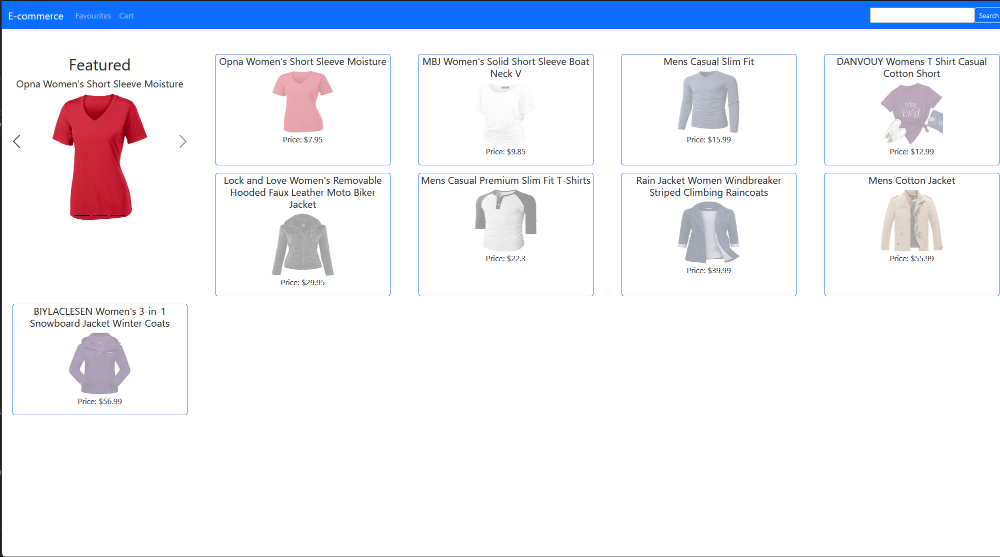
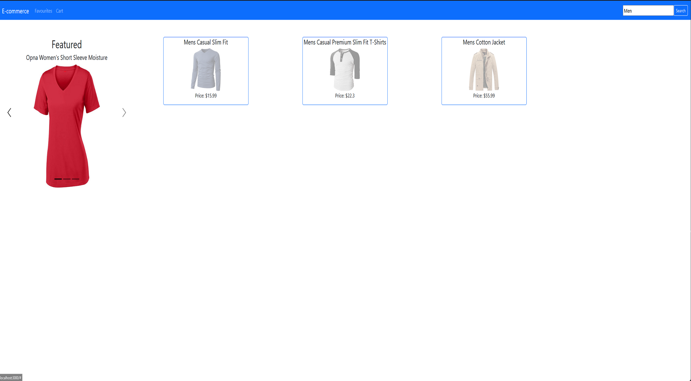
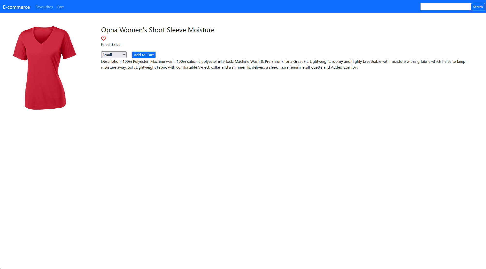
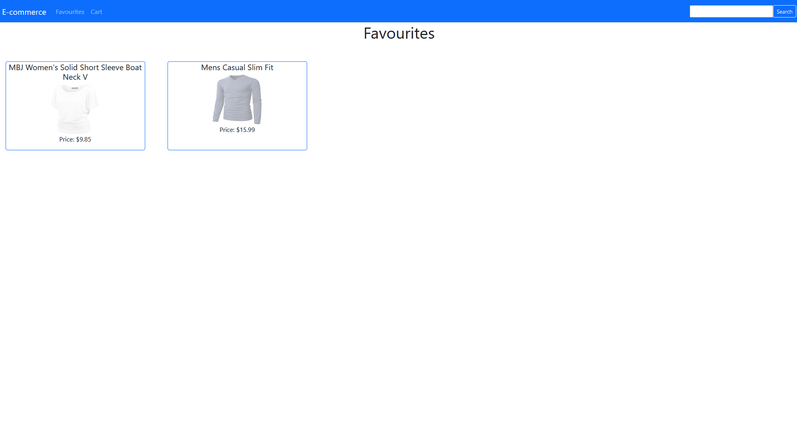
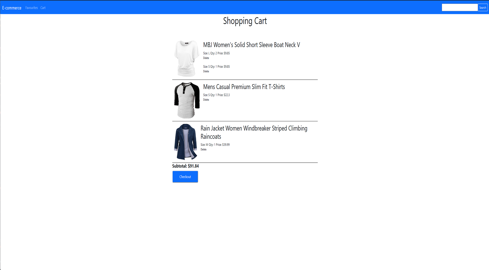

# e-commerce-project

https://samuel-b.github.io/e-commerce-project/

# Screenshots

# Description

E-commerce CRUD application using React as the front-end to and Firestore as the back-end (noSQL database)

# Requirements

MVP: 2 pages:

- Home Page
- Grid of products
- Carousel of featured products
- Product Page (with id parameter)

All products should be stored in Firestore, you should store the following information:

- Quantity
- Variants (could be colors, sizes, etc)
- Price per unit
- Name
- Image url
- Favourited or not (boolean)

All data should be stored in Firestore and fetched by the frontend, there should be NO static product data in the react application

***Bonus:***
Using Firestore and react create, a cart system.Create a cart page in your react appAdd logic to prevent users from adding items to cart that are no longer in stock.You will have to check the current cart and the product quantityCart page should have the following:

- List of products in cart
- ability to change quantity of products in cart
- ability to remove items from cart

Make sure you site is scope to one category of products

# Implementation Details

## Technology

-   React
-   Firestore (noSQL DB)
-   SCSS
-   React Bootstrap
-   Javascript
-   Git & Github

## Design

A user-friendly single page application (SPA) utalising react-router-dom, bootstap components and functional components.

## Lifecycle

-   Project was delivered feature at a time on seperate branchesand merged with the main branch after review.

# In The Future

### What I would like to implement in the furure

- Update qty of an item from the cart 
